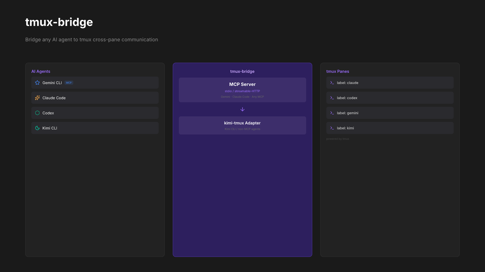

# tmux-bridge

**English** | [简体中文](README.zh-CN.md)

Standalone MCP server + CLI adapters for cross-pane AI agent communication via tmux. No external dependencies beyond `tmux` itself.

- **For MCP agents** — Gemini CLI, Claude Code, or any MCP client gets structured tool calls with built-in read guards
- **For non-MCP agents** — `kimi-tmux` wraps Kimi CLI with auto tool-call parsing and multi-turn support
- **For all agents** — system instruction teaches the read-act-read workflow out of the box

```bash
# MCP agents (Gemini, Claude Code)
npx @anthropic-fans/tmux-bridge

# Kimi CLI
kimi-tmux "ask the codex pane to review src/auth.ts"
```



## Prerequisites

- **tmux 3.2+** — the only runtime dependency
  - macOS: `brew install tmux`
  - Linux: `apt install tmux` / `dnf install tmux`

## Install

```bash
npm install -g @anthropic-fans/tmux-bridge
```

## MCP Server

Works with any MCP-compatible agent over stdio.

### Gemini CLI

Add to `~/.gemini/settings.json`:

```json
{
  "mcpServers": {
    "tmux-bridge": {
      "command": "npx",
      "args": ["@anthropic-fans/tmux-bridge"]
    }
  }
}
```

### Claude Code

Add to your MCP config:

```json
{
  "mcpServers": {
    "tmux-bridge": {
      "command": "npx",
      "args": ["@anthropic-fans/tmux-bridge"]
    }
  }
}
```

### Tools

| Tool | Description |
|------|-------------|
| `tmux_list` | List all panes with target, process, label, cwd |
| `tmux_read` | Read last N lines from a pane (satisfies read guard) |
| `tmux_type` | Type text into a pane without pressing Enter |
| `tmux_message` | Send message with auto-prepended sender info |
| `tmux_keys` | Send special keys (Enter, Escape, C-c, etc.) |
| `tmux_name` | Label a pane for easy targeting |
| `tmux_resolve` | Look up pane ID by label |
| `tmux_id` | Print current pane's tmux ID |
| `tmux_doctor` | Diagnose tmux connectivity issues |

## Kimi CLI Adapter

Kimi CLI doesn't support MCP natively. `kimi-tmux` bridges the gap:

```bash
kimi-tmux "list all tmux panes"
kimi-tmux "ask the agent in codex pane to review src/auth.ts"
kimi-tmux "read what claude is working on"
kimi-tmux --rounds 3 "send a message to gemini and wait for the result"
```


How it works:

1. Injects system instruction as system prompt
2. Runs Kimi in `--print` non-interactive mode
3. Parses ` ```tool``` ` blocks from output (JSON or function-call style)
4. Executes them directly via tmux commands
5. Feeds results back with full transcript (up to 5 rounds)


## Agent Collaboration

### Gemini ↔ Claude Code (via MCP server)

Gemini uses MCP tool calls:

```
tmux_read(target="claude", lines=20)
tmux_message(target="claude", text="What's the test coverage for src/auth.ts?")
tmux_read(target="claude", lines=5)
tmux_keys(target="claude", keys=["Enter"])
```

### Kimi ↔ Any Agent (via kimi-tmux)

```bash
kimi-tmux "tell the claude pane to run the test suite"
```

### Multi-Agent Setup

```
┌───────────────────────────────────────────────────────────┐
│ tmux session                                              │
│                                                           │
│ ┌────────────┐ ┌────────────┐ ┌──────────┐ ┌───────────┐ │
│ │ Claude Code │ │   Codex    │ │ Gemini   │ │   Kimi    │ │
│ │  (MCP)     │ │  (MCP)     │ │  (MCP)   │ │(kimi-tmux)│ │
│ │            │ │            │ │          │ │           │ │
│ │ label:     │ │ label:     │ │ label:   │ │ label:    │ │
│ │ claude     │ │ codex      │ │ gemini   │ │ kimi      │ │
│ └─────┬──────┘ └─────┬──────┘ └────┬─────┘ └─────┬─────┘ │
│       └──────────────┴─────────────┴─────────────┘       │
│           tmux-bridge (direct tmux IPC, no deps)          │
└───────────────────────────────────────────────────────────┘
```

## How It Works

```
MCP path (Gemini, Claude Code, any MCP client):
┌─────────────┐  MCP/stdio  ┌──────────────┐  tmux API  ┌─────────────┐
│  MCP Agent   │◄───────────►│  tmux-bridge  │◄──────────►│  tmux panes  │
└─────────────┘             │  MCP server   │            └─────────────┘
                            └──────────────┘

CLI path (Kimi):
┌─────────────┐  --print    ┌──────────────┐  tmux API  ┌─────────────┐
│  Kimi CLI    │◄───────────►│  kimi-tmux    │◄──────────►│  tmux panes  │
└─────────────┘  tool parse │  adapter      │            └─────────────┘
                            └──────────────┘
```

No intermediate CLI layer — tmux-bridge talks directly to `tmux` via `capture-pane`, `send-keys`, `list-panes`, etc.

## System Instruction

For agents that support custom system prompts, copy `system-instruction/smux-skill.md` into your agent's config. This teaches the read-act-read workflow:

1. **Read before act** — always read a pane before typing or sending keys
2. **Read-Act-Read cycle** — type, verify, then press Enter
3. **Never poll** — other agents reply directly into your pane
4. **Label early** — use `tmux_name` for human-readable pane addressing

## Environment Variables

| Variable | Description | Default |
|----------|-------------|---------|
| `TMUX_BRIDGE_SOCKET` | Override tmux server socket path | Auto-detected from `$TMUX` |
| `KIMI_PATH` | Path to `kimi` binary (kimi-tmux only) | `kimi` (in PATH) |

## Roadmap

### v0.1 (current)
- Standalone MCP server — direct tmux interaction, no external CLI deps
- `kimi-tmux` CLI adapter with multi-turn tool loop and full transcript
- Read guard enforcement at the MCP layer
- System instruction for any agent

### v0.2
- Auto-label panes by detecting running agent process
- Health check / heartbeat between agents
- Agent capability advertisement

## Related Projects

| Project | Approach | Focus |
|---------|----------|-------|
| [smux](https://github.com/ShawnPana/smux) | tmux skill + bash CLI | Agent-agnostic tmux setup |
| [agent-bridge](https://github.com/raysonmeng/agent-bridge) | WebSocket daemon + MCP plugin | Claude Code ↔ Codex |
| **tmux-bridge** (this) | Standalone MCP server + direct tmux | Any agent, zero deps |

## License

MIT
